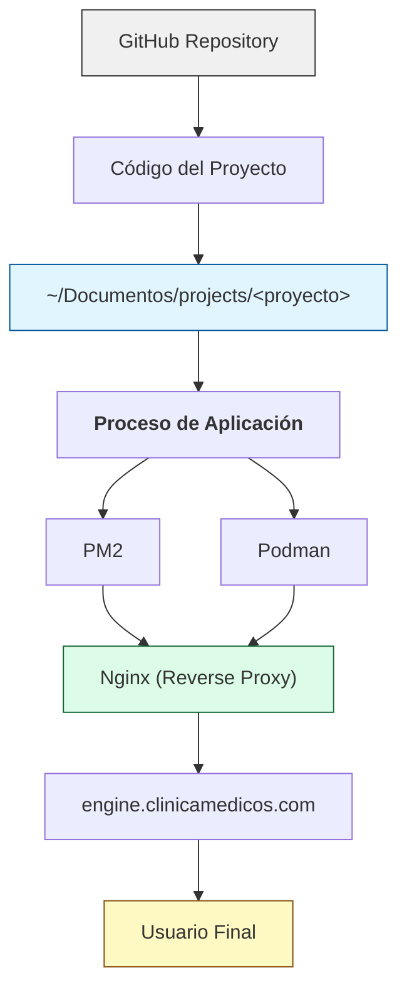

Una aplicación independiente puede involucrar varias capas dentro del servidor.

No todos los proyectos utilizan Podman. Su utilización depende de los requerimientos específicos de cada aplicación.

<Warning>
  Los nuevos desarrollos deben evaluar su incorporación dentro de **ATLAS** antes de crear una nueva infraestructura independiente.
</Warning>
