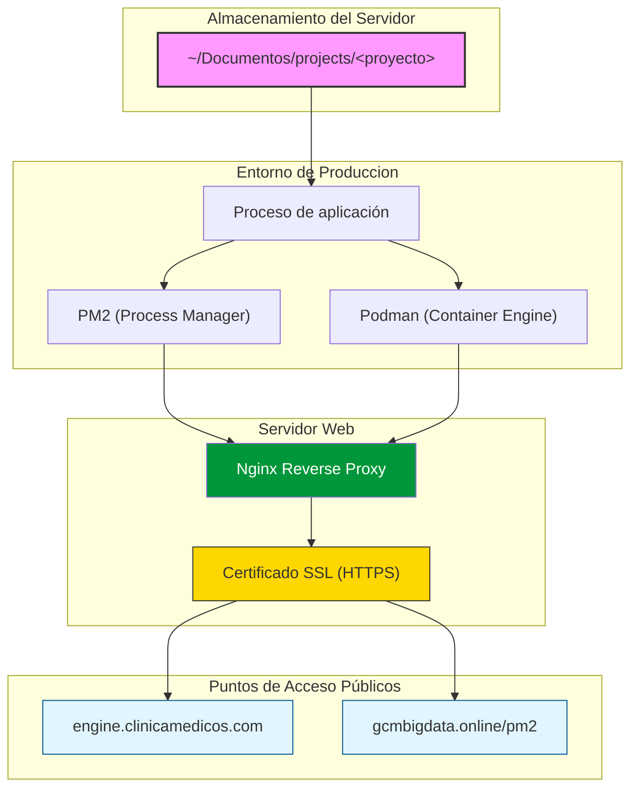

Existe una separación entre el código de las aplicaciones y la configuración utilizada para exponerlas externamente.

## Código de los proyectos

```text
/home/rpatic/Documentos/projects/<proyecto>
```

## Configuración de Nginx

```text
/etc/nginx/conf.d/apps/<proyecto>.conf
```

## Relación general



Esta separación permite administrar la configuración de acceso externo sin modificar directamente el código de la aplicación.

<Info>
  Esta estructura se explica porque así se hacía anteriormente para cada proyecto nuevo, pero con **ATLAS** ya todo eso cambió: cada proyecto nuevo simplemente es un nuevo módulo de **ATLAS**, por lo tanto ya no es necesario crear nuevos archivos `.conf` (por el momento).
</Info>
