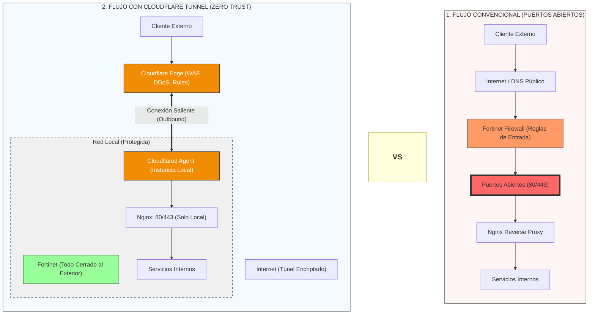

Una duda común cuando se ve por primera vez `cloudflared` corriendo es: "¿publicar hacia internet no es inseguro?". La respuesta corta es **no**: usar Cloudflare Tunnel es de hecho más seguro que abrir puertos, porque **no abrimos nada** en el servidor. Esta página explica el porqué comparando los dos flujos.

## Flujo convencional: puertos abiertos

Este es el camino "clásico" que se usa cuando un servicio interno se quiere exponer a internet a través del dominio corporativo:

```text
Cliente → DNS público (engine.clinicamedicos.com)
       → Fortinet (reglas, firewall)
       → Puertos 443/80 abiertos hacia el servidor
       → Nginx (reverse proxy)
       → Servicios internos
```

Para que este flujo funcione, hay que **abrir los puertos 443 y 80** de forma que puedan ser accedidos desde el exterior.

<Warning>
  Abrir un puerto entrante es abrir un hueco que Fortinet debe proteger constantemente. Cada puerto abierto es superficie de ataque: escaneos, fuerza bruta contra el reverse proxy, exploits contra la versión de Nginx, bots buscando rutas conocidas, etc.
</Warning>

Puntos débiles del modelo:

- **Puertos entrantes activos** en el borde: cualquier IP de internet puede intentar conectarse.
- **La seguridad depende 100% de las reglas de Fortinet** y de que estén bien mantenidas.
- **El servidor ve tráfico directo de internet** en sus puertos públicos.
- **Escalar protección** (WAF, anti-DDoS, rate limits, reglas por país) requiere hardware/licencias adicionales o reglas complejas en el firewall.

## Flujo con Cloudflare Tunnel

Con `cloudflared`, el camino cambia:

```text
Cliente → Cloudflare Edge (WAF, DDoS, rules)
       ═══ túnel saliente encriptado ═══
       → cloudflared agent (dentro del servidor)
       → Nginx (127.0.0.1:443)
       → Servicios internos
```

Diferencias clave:

- **La conexión la abre el servidor** hacia Cloudflare (outbound), no al revés.
- **No hay puertos entrantes abiertos**. Fortinet puede tener 443/80 cerrados hacia el exterior.
- **El cliente nunca habla con nosotros directamente**. Solo habla con los servidores edge de Cloudflare.
- **Cloudflare filtra antes de que el tráfico entre al túnel**: DDoS, WAF, reglas, rate limits, bloqueos por país, Bot Fight Mode, etc.
- **Nginx sigue escuchando solo en localhost** (`127.0.0.1:443`), no expuesto en la interfaz pública.

<Tip>
  La regla mental es: en el modelo con túnel, el atacante ni siquiera puede enviar un paquete al servidor. Todo lo que llega tuvo que pasar primero por la infraestructura de Cloudflare.
</Tip>

## Comparación visual



## Comparación lado a lado

| Aspecto | Puertos abiertos | Cloudflare Tunnel |
| --- | --- | --- |
| Sentido de la conexión | Cliente → servidor (entrante) | Servidor → Cloudflare (saliente) |
| Puertos abiertos en Fortinet | 80/443 hacia el exterior | Ninguno hacia el exterior |
| Punto de entrada público | El servidor mismo | Cloudflare Edge |
| WAF / anti-DDoS | Depende de Fortinet/hardware | Incluido en Cloudflare |
| Reglas por país, rate limits, Bot Fight | Configuración manual costosa | Nativo en Cloudflare |
| Superficie de ataque contra el servidor | Alta: cualquier IP puede tocar la puerta | Nula: no hay puerta que tocar |
| Escaneos de internet ven el servicio | Sí | No |

## Conclusión

Con Cloudflare Tunnel:

- **No abrimos huecos** en la red.
- **Cloudflare hace de escudo** con WAF, DDoS y reglas que ya vienen incluidas.
- **Nginx y los servicios internos siguen siendo internos**; solo aceptan tráfico desde `127.0.0.1` a través del agente `cloudflared`.
- **Fortinet queda cerrado hacia el exterior**, y su papel se reduce a proteger la red interna.

Publicar por túnel no es "exponer el servidor", es **mover el borde público a Cloudflare** y dejar el servidor detrás de una capa que ya está diseñada para recibir tráfico hostil.

Para ver la configuración concreta que aplica esta idea, revisa [Configurar el túnel](/tunnel/configurar-tunel).