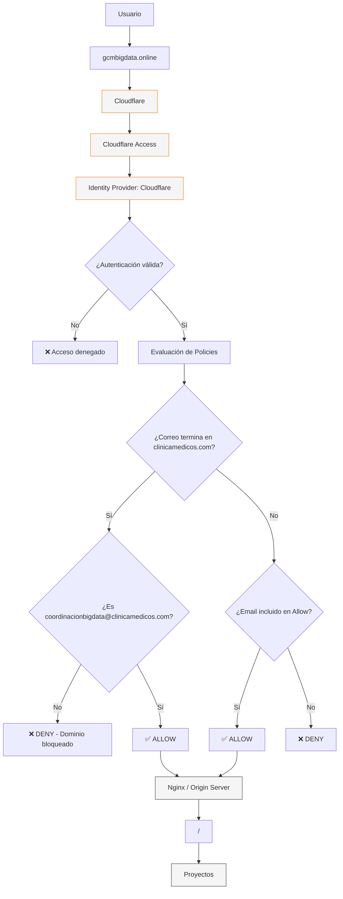

Continuando con la explicación de por qué este cloudflared tunnel es más seguro, vamos ahora hablar de la siguiente capa de seguiridad que tiene aplicada. Para ello hablaremos de Zero Trust, un modelo de seguridad informática que exige verificar la identidad de cada usuario y dispositivo antes de darles acceso a los sistemas, bajo la regla de "nunca confiar, siempre verificar".



Por lo tanto, todo intento de acceso no autorizado quedará bloqueado, solo los usuarios cuyo correo sea valido podrá ingresar al tunnel. 

1. Para configurarlo debemos ir a cloudflared, una vez estemos dentro del dashboard administrativo con la cuenta institucional de coordinacionbigdata, debemos dirigirnos a la pestaña llamada **Zero Trust** 
   
2. Una vez estamos en esa categoría, debemos seleccionar la pestaña de Access controls, la cual desplegará un menu con siete opciones, la que debemos seleccionar es la opción de Policies.<br />
   
3. Para crear nuestra politica, debemos seleccionar el botón azul "Add a policy".<br />
   
4. Una vez hayamos dado click en el botón, donde encontraremos un formulario para configurar la politica. Encontraremos del lado izquierdo las reglas de esa politica, del lado derecho los detalles.<br />
   

# Cloudflare Access — Policy Rules

Una **Policy** de Cloudflare Access define las condiciones bajo las cuales un usuario puede acceder a una aplicación protegida.

Una policy combina principalmente:

- **Include:** define a quién se aplica la policy.
- **Exclude:** define excepciones que deben quedar fuera.
- **Require:** define condiciones adicionales que deben cumplirse.
- **Action:** define qué ocurre cuando el usuario coincide con la policy.

---

## 1. OR

Dentro de una policy, las reglas de **Include** se evalúan utilizando una lógica **OR**.

Esto significa que el usuario solamente necesita cumplir **una de las condiciones** para coincidir con el bloque `Include`.

### Ejemplo

```text
Include

Email = usuario1@gmail.com
OR
Email = usuario2@gmail.com
OR
Email = usuario3@gmail.com
```

En este caso:

| Usuario | ¿Coincide con Include? |
| --- | --: |
| `usuario1@gmail.com` | ✅ |
| `usuario2@gmail.com` | ✅ |
| `usuario3@gmail.com` | ✅ |
| `otro@gmail.com` | ❌ |

El usuario **no necesita cumplir las tres condiciones**. Basta con que cumpla una.

### Ejemplo aplicado al proyecto

```text
Include

Email = coordinacionbigdata@clinicamedicos.com
OR
Email = catapiascastro@gmail.com
OR
Email = saramirez@unicesar.edu.co
```

La policy coincide con cualquiera de estos tres usuarios.

### Idea clave

> **OR significa que basta con cumplir una de las reglas Include.**

---

# 2. Include

`Include` define **quién o qué queda dentro del alcance de la policy**.

Puede interpretarse como:

> **"¿A quién quiero aplicar esta policy?"**

Por ejemplo:

```text
Include

Email = catapiascastro@gmail.com
```

significa que `catapiascastro@gmail.com` está incluido en el alcance de esa policy.

Sin embargo, **Include no significa "permitir" por sí mismo**.

El comportamiento final depende de la combinación entre `Include` y `Action`.

### Include + Allow

```text
Action: Allow

Include:
    Email = usuario@gmail.com
```

El flujo conceptual sería:

```text
usuario@gmail.com
       ↓
   Coincide
       ↓
     Allow
       ↓
    ✅ Acceso
```

### Include + Deny

También podemos utilizar `Include` junto con una acción `Deny`:

```text
Action: Deny

Include:
    Emails ending in @clinicamedicos.com
```

En este caso, cualquier usuario cuyo correo termine en `@clinicamedicos.com` coincide con la policy y será rechazado.

```text
usuario@clinicamedicos.com
          ↓
       Coincide
          ↓
         Deny
          ↓
       ❌ Acceso
```

### Idea clave

> **Include determina quién coincide con la policy.**
>
> **Action determina qué hacer con quienes coinciden.**

Por lo tanto:

```text
Include = ¿A quién se aplica?
Action  = ¿Qué hago con ellos?
```

---

# 3. Selector

El **Selector** determina qué característica del usuario, dispositivo o solicitud se utilizará para construir una regla.

En otras palabras:

> **"¿Qué atributo voy a utilizar para identificar a quién se aplica esta regla?"**

Dependiendo de la configuración y del tipo de aplicación, Cloudflare Access puede ofrecer diferentes selectores.

Algunos ejemplos son:

- Email
- Emails ending in
- Email domain
- Everyone
- Login Methods
- Country
- IP
- Groups
- Service Token

### Ejemplo: Emails ending in

Si seleccionamos:

```text
Emails ending in
```

y utilizamos:

```text
@clinicamedicos.com
```

la regla coincidirá con cualquier usuario cuyo correo termine en ese dominio.

Por ejemplo:

```text
juan@clinicamedicos.com
maria@clinicamedicos.com
pedro@clinicamedicos.com
```

Todos coincidirán con la regla.

### Diferencia entre Email y Emails ending in

**Email** identifica un usuario específico:

```text
Email = juan@gmail.com
```

Mientras que **Emails ending in** permite identificar un conjunto de usuarios mediante su dominio:

```text
Emails ending in = @clinicamedicos.com
```

Por lo tanto:

```text
Email
    ↓
Usuario específico

Emails ending in
    ↓
Conjunto de usuarios de un dominio
```

---

# 4. Policy name

`Policy name` es el nombre identificativo de la policy.

No modifica el comportamiento de la policy; sirve principalmente para **identificarla y administrarla**.

Se recomienda utilizar nombres descriptivos que indiquen:

1. La aplicación.
2. La acción.
3. El grupo o condición afectada.

### Ejemplos

```text
PM2 - Allow - Authorized Users
```

```text
PM2 - Deny - Clinicamedicos Domain
```

```text
PM2 - Require - MFA
```

Una convención de nombres consistente facilita la administración cuando existen múltiples aplicaciones y policies.

---

# 5. Action

`Action` define **qué debe hacer Cloudflare cuando una solicitud coincide con la policy**.

Las acciones principales para este escenario son:

- `Allow`
- `Deny`

---

## 5.1 Allow

`Allow` permite el acceso a los usuarios que coincidan con la policy y cumplan las condiciones establecidas.

### Ejemplo

```text
Action: Allow

Include:
    Email = catapiascastro@gmail.com
```

Flujo:

```text
catapiascastro@gmail.com
          ↓
       Include
          ↓
        Allow
          ↓
      ✅ Acceso
```

---

## 5.2 Deny

`Deny` rechaza el acceso a los usuarios que coincidan con la policy.

### Ejemplo

```text
Action: Deny

Include:
    Emails ending in @clinicamedicos.com
```

Flujo:

```text
usuario@clinicamedicos.com
          ↓
       Include
          ↓
         Deny
          ↓
      ❌ Acceso
```

### Idea clave

La relación entre `Include` y `Action` puede resumirse así:

```text
Include
   ↓
¿Quién coincide?

   +

Action
   ↓
¿Qué hacemos con quienes coinciden?
```

Por ejemplo:

```text
Include: usuario@gmail.com
Action: Allow
```

significa:

> Si el usuario es `usuario@gmail.com`, permitir el acceso.

Mientras que:

```text
Include: @clinicamedicos.com
Action: Deny
```

significa:

> Si el usuario pertenece al dominio `@clinicamedicos.com`, denegar el acceso.

---

# 6. Policy session duration

`Policy session duration` determina cuánto tiempo puede mantenerse la sesión de Cloudflare Access para los usuarios que coinciden con esa policy.

Por ejemplo:

```text
Policy session duration: 1 hour
```

significa que la sesión estará limitada por esa duración y, cuando corresponda, el usuario deberá volver a autenticarse.

## Prioridad de la duración

La duración configurada en una policy puede sobrescribir las duraciones configuradas a nivel de aplicación y global.

Conceptualmente:

```text
Global session duration
          ↓
Application session duration
          ↓
Policy session duration
          ↓
   Tiene prioridad
```

Por esta razón, si una policy establece explícitamente una duración, esa configuración prevalece sobre las configuraciones generales.

### Ejemplo

Supongamos:

```text
Global:
    24 hours

Application:
    12 hours

Policy:
    4 hours
```

Para los usuarios afectados por esa policy, la duración aplicable será:

```text
4 hours
```

### Consideración de seguridad

Para aplicaciones administrativas o sensibles, como un panel de **PM2**, es recomendable evaluar una duración de sesión que equilibre:

- Seguridad.
- Comodidad para los administradores.
- Frecuencia de reautenticación.

Una sesión demasiado larga aumenta el tiempo durante el cual una sesión comprometida podría ser utilizada.

---

# Resumen

Los elementos principales de una Cloudflare Access Policy pueden entenderse de esta manera:

| Elemento | Función |
| --- | --- |
| **Selector** | Define qué atributo se utilizará para identificar al usuario o solicitud. |
| **Include** | Define quién coincide con la policy. |
| **OR** | Indica que basta con cumplir una de las reglas `Include`. |
| **Exclude** | Define excepciones que no deben coincidir con la policy. |
| **Require** | Añade condiciones adicionales que deben cumplirse. |
| **Action** | Define qué ocurre cuando la policy coincide (`Allow` / `Deny`). |
| **Policy name** | Identifica la policy dentro de Cloudflare Access. |
| **Policy session duration** | Define la duración de sesión específica para esa policy. |
| **MFA** | Permite establecer requisitos adicionales de autenticación multifactor. |
| **JIT** | Permite gestionar acceso temporal y sujeto a aprobación. |

La forma más sencilla de recordar la estructura es:

```text
Selector
    ↓
¿Qué atributo utilizo?

Include
    ↓
¿Quién coincide?

Exclude
    ↓
¿Quién queda fuera?

Require
    ↓
¿Qué condiciones adicionales debe cumplir?

Action
    ↓
¿Qué hago si coincide?
    ├── Allow → ✅ Permitir
    └── Deny  → ❌ Denegar
```

5. Una vez creada, simplemente guardamos la politica, la cual veremos de la siguiente manera: <br />
   
   <br />
